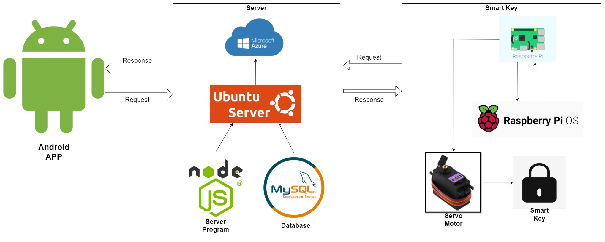
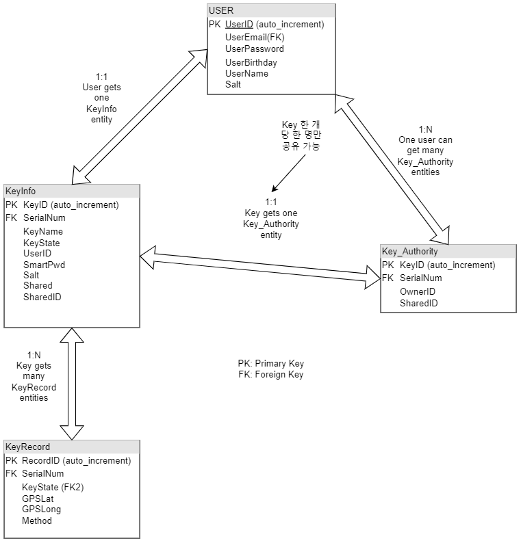
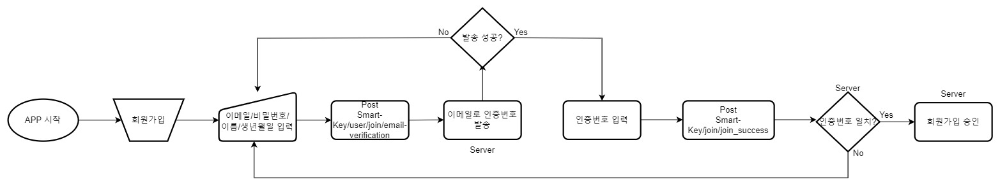
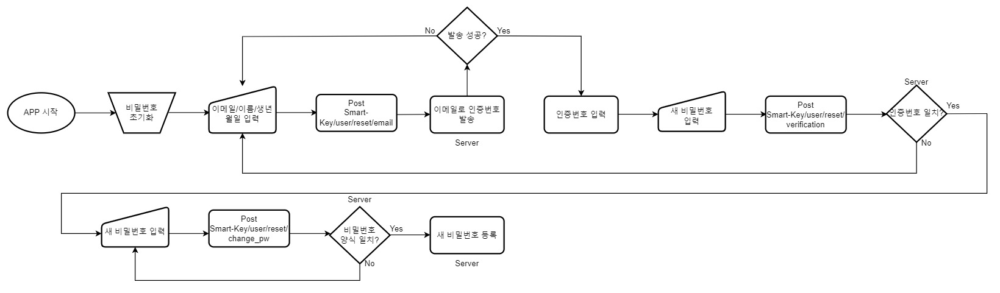
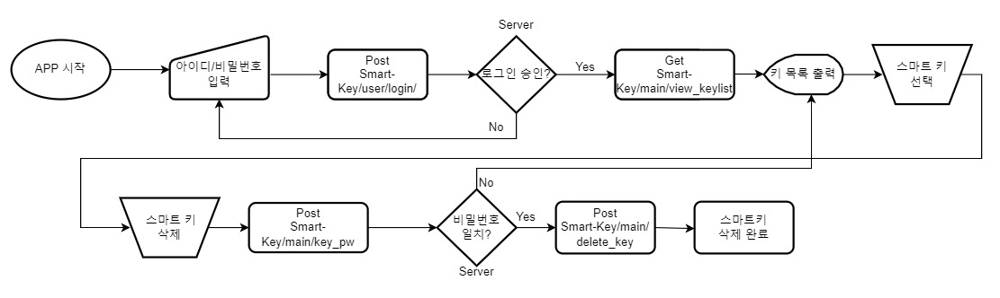
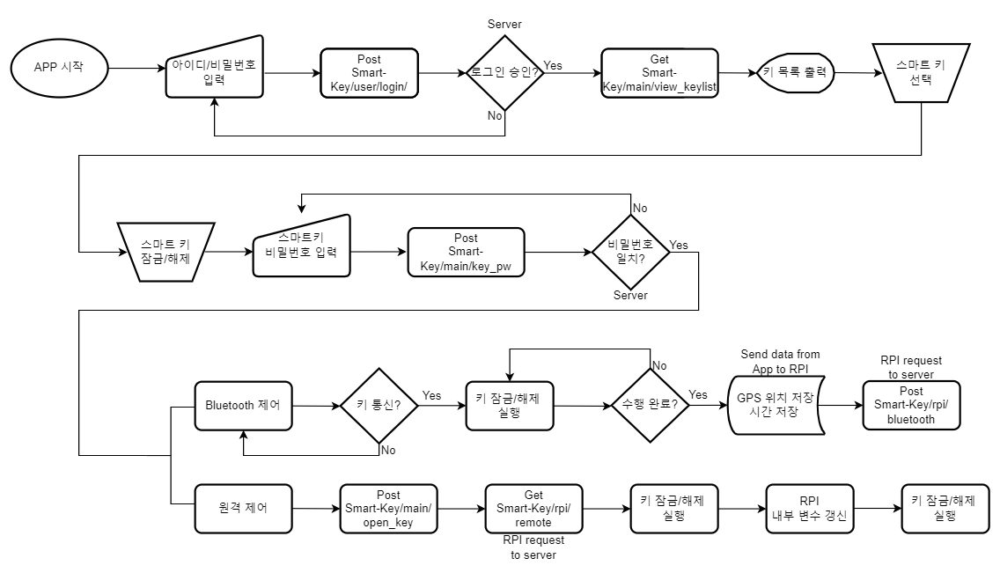
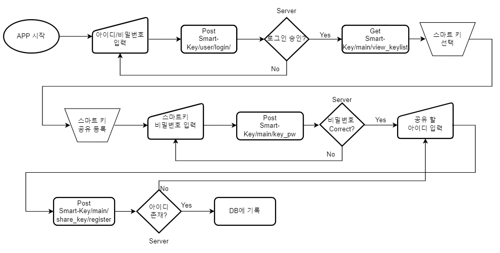
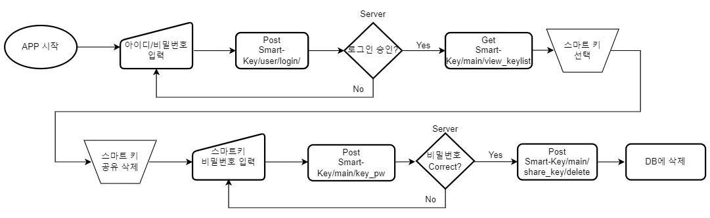

# IoT 기반 스마트 키 (Smart Lock System Based on Internet of Things)

2022 컴퓨터공학부 종합설계 IoT 기반 스마트 키 Github 입니다.

## Contributor

|App Development|Server Development|RPI Development|
|:---:|:---:|:---:|
|이재용|이창현(Repository Owner)|김태형(Team Leader)|
|||
|[Yonge2](https://github.com/Yonge2) |[luminousxv](https://github.com/luminousxv) | [createcodemyself](https://github.com/createcodemyself) |

## What will be added
### Server
- Conversion from 
to  (Started 22.07.12)
- Refactoring
- Update Readme

## README 모음집

- Server

    [User 관련 API README](https://github.com/luminousxv/Smart-Key/blob/main/Server/USER%20README.md)

    [Key 관련 API README](https://github.com/luminousxv/Smart-Key/blob/main/Server/KEY%20API%20README.md)

    [RPI 관련 API README](https://github.com/luminousxv/Smart-Key/blob/main/Server/RPI%20API%20README.md)

    [Share 관련 API README](https://github.com/luminousxv/Smart-Key/blob/main/Server/SHARE%20API%20README.md)

- Android

    [Android Application README](https://github.com/luminousxv/Smart-Key/blob/main/Android/Android_README.md)

- RPI

    [Raspberry PI README](https://github.com/luminousxv/Smart-Key/blob/main/Raspberry_PI/RPI_README.md)

## File Structure (2022.07.12 수정)

- Server
    - dist (actual running folder)

    - src
        
        app.ts (main server program)

        - types

            type.ts (API type definition)
        
        - routes
            
            join.ts (Join API)
            
            login.ts (Login API)

            resetPW.js (reset_pw API)

            keylist.ts (view keylist API)

            register_key.js (register new key API)

            delete_key.js (delete key API)

            keyrecord.js (view keyrecord API)

            keyPW.js (key password verification API)

            keycontrol.js (key control API)

            keyshare.js (Key Share API)

            rpi_control.js (Raspberry Pi control API)

            rpi_image.js (Raspberry Pi Image API)
            
        - database
            
            dbconnection.js (Database Connection Configuration)

- Android

    - SmartKey_ver10

        build.gradle (gradle properties)

        - app
        
            - src

                - main

                    - /java/com/exmaples/smartkey_ver10

                        CookieHandler.kt (session cookie handler)

                        MainActivity.kt (login)

                        RecyclerAdapter.kt (recyler view)

                        Register_login.kt (join)

                        Retrofit_Interface.kt (request url)

                        Retrofit_dataClass.kt (request data format)

                        Retrofit_service.kt (base url)

                        SharedPrefApp.kt (local variable storage)

                        SmartkeyDetailAct.kt (key control)

                        SmartkeyLogAct.kt (key record)

                        SmartkeyMain.kt (key list)

                        SmartkeyPwDailog.kt (key password dialog)

                - res

                    - layout

                        activity_main.xml (login xml)

                        activity_register_login.xml (join xml)

                        activity_smartkey_detail.xml (key control xml)

                        activity_smartkey_log.xml (key record xml)

                        activity_smartkey_main.xml (key list xml)

                        dialog_smartkey_pw.xml (key password dialog xml)

                        item_view.xml (recycler view xml)

- Raspberry_PI

    rpi_module.py (Smart Key python application)

## System Diagram

| |Server|Smart Key|Android Application|
|:---:|:---:|:---:|:---:|
|**System**|Microsoft Azure|Raspberry PI 4B|Android Emulator(test)|
|**OS**|Ubuntu Server 20.04 LTS|Raspberry PI OS|Android|
|**Language**|Node.JS(TypeScript)|Python|Kotlin|
||DB: MySQL|Motor: Servo|IDE: Android Studio|

## System Flowchart

## Database Structure

<strike>현재(2.15) SHARE_INFO 테이블 외에는 전부 서버에 적용 시킨 상태이다.</strike>  
-(2.21)-  
공유 확인은 권한 테이블로 판단. 서버에서 스마트키 권한 확인 여부를 위한 Key_Authority 테이블 추가.  
테이블 이름 및 Attribute 최신화.

## Application Flowchart

### Join

앱에서 회원가입 버튼을 누르면 해당 정보들을 입력 후 서버로 전송.

서버는 중복 확인 후 세션으로 저장 후 해당 이메일로 인증번호 발송.

사용자는 등록 할 이메일에서 인증번호 이메일을 확인하고 앱에서 인증번호 입력 후 서버로 전송.

서버는 인증번호 일치 여부 확인 후 세션에 있던 정보를 DB에 기록.

### Reset Password

앱에서 이메일/이름/생년월일을 입력 한 후 서버로 전송.

서버는 해당 정보가 존재하는지 판단하고, 존재하면 해당 이메일로 인증번호 전송. 인증번호는 세션으로 저장.

사용자는 해당 이메일에서 인증번호 이메일을 확인하고 앱에서 인증번호 입력 후 서버로 전송.

서버는 해당 인증번호가 세션에 저장되어있는 값과 일치하는지 판단. 같으면 앱(클라이언트)로 성공 리스폰스 전송.

앱에서 새로운 비밀번호 입력 후 서버로 전송. 서버는 입력받은 비밀번호가 양식에 맞는지 판단 후 DB에 갱신.

### Register Key

앱에서 이메일/비밀번호 입력 후 서버로 전송.

서버는 해당 정보가 DB와 일치하는지 판단 후 결과 전송.

로그인 성공 시 등록된 사용자의 키 목록을 서버로 요청.

서버에서 키 목록을 받은 후, 새 스마트키 등록 버튼 클릭.

처음 연결이므로 해당 키와 블루투스 연결 후 시리얼 번호 통신.

받은 시리얼 번호와 입력한 이름/비밀번호(스마트키 전용)를 서버로 전송.

서버는 받은 정보에 중복(시리얼 번호)가 없는지 판단 후 DB에 기록.

### Delete Key

앱에서 이메일/비밀번호 입력 후 서버로 전송.

서버는 해당 정보가 DB와 일치하는지 판단 후 결과 전송.

로그인 성공 시 등록된 사용자의 키 목록을 서버로 요청.

서버에서 키 목록을 받은 후, 삭제 할 키 선택.

키 삭제 버튼 클릭. 키 비밀번호 입력 후 서버로 전송.

서버는 해당 키 비밀번호가 일치하는지 확인 후 DB에 해당 키 삭제(키 목록 + 이력).

### Key Control

앱에서 이메일/비밀번호 입력 후 서버로 전송.

서버는 해당 정보가 DB와 일치하는지 판단 후 결과 전송.

로그인 성공 시 등록된 사용자의 키 목록을 서버로 요청.

서버에서 키 목록을 받은 후, 제어 할 키 선택.

잠금/해제 버튼 클릭. 키 비밀번호 입력 후 서버로 전송.

서버는 해당 키 비밀번호가 일치하는지 확인 후 결과를 전송.

- Bluetooth 통신으로 제어 시
    
    키와 Bluetooth 통신으로 제어. 앱은 RPI에게 제어 명령과 GPS 정보 전송.

    RPI는 해당 명령 수행 후 내부 변수 갱신 후 GPS 정보와 수행 내용(open/close)를 서버로 전송.

    서버는 해당 정보를 KEY_INFO 및 KEY_RECORD 테이블에 갱신/기록.

- 원격 통신으로 제어 시

    앱에서 해당 명령에 맞는 url로 전송 (사진은 open으로 예시).

    서버에서는 해당 값을 KEY_INFO 및 KEY_RECORD 테이블에 갱신/기록.

    RPI는 주기적으로 해당 KeyState값을 서버로 요청하고 있음.

    값이 변경이 된 것을 확인하면 바뀐 값으로 해당 기능 수행

### Share Key

앱에서 이메일/비밀번호 입력 후 서버로 전송.

서버는 해당 정보가 DB와 일치하는지 판단 후 결과 전송.

로그인 성공 시 사용자의 키 목록을 서버로 요청.

서버에서 키 목록을 받은 후, 제어 할 키 선택.

등록 버튼 클릭, 키 비밀번호 입력 후 서버로 전송.

해당 비밀번호가 맞으면 앱은 공유 할 아이디 입력 후 서버로 전송.

서버에서는 보낸 정보들이 유효한지 확인 후, 유효하면 DB에 기록.

앱에서 이메일/비밀번호 입력 후 서버로 전송.
서버는 해당 정보가 DB와 일치하는지 판단 후 결과 전송.

로그인 성공 시 사용자의 키 목록을 서버로 요청.

서버에서 키 목록을 받은 후, 제어 할 키 선택.

등록 버튼 클릭, 키 비밀번호 입력 후 서버로 전송.

해당 비밀번호가 맞으면 앱은 삭제 API 호출.

서버는 DB에 해당 키 공유 관련 데이터 삭제.
