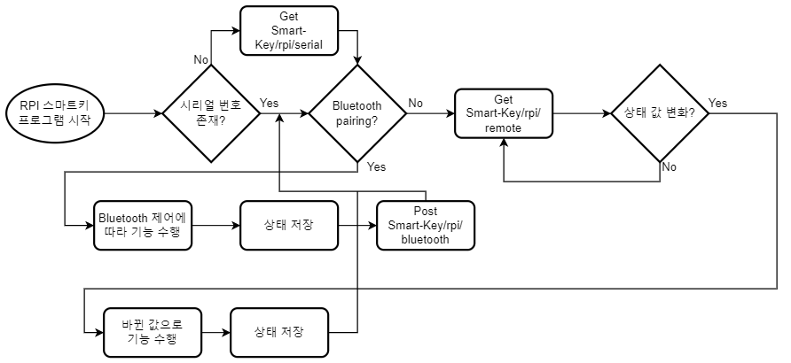

# Raspberry Pi README
## 개요
라즈베리파이 4B 보드를 이용해서 스마트키 임베디드 시스템을 만들었다. 

주요 기능으로는 블루투스, WIFI(원격)을 이용하여 서보 모터 제어를 해서 스마트키 잠금/해제를 하고, 

모션 센서를 이용해서 사용자가 가까이 다가가면 LCD 화면이 켜지게 한다. LCD 화면에는 잠금/해제를 시행하면

open/close로 출력이 되고, 에러(서버 연결x)가 나오면 에러 메시지를 출력해준다. 또한 

보안모드를 설계하여 사용자가 보안모드를 on 하면 카메라가 켜지고 도난 방지를 위해 자물쇠 모듈에 자이로 센서를

부착하여 해당 모듈의 움직임이 감지될시 사진을 찍어 앱으로 보내는 기능을 탑제하였다. 

## rpi_module.py 코드 설명
~~~python
from bluetooth import *  # 블루투스 모듈
import RPi.GPIO as GPIO  # 라즈베리파이 GPIO 관련 모듈
import time                     # time 제어를 위한 라이브러리
import json                     # 서버 통신을 위한 json 라이브러리
import requests                 # 서버 요청 라이브러리
import os
import drivers                  # lcd 조작을 위한 라이브러리
import serial, close_state, open_state   #시리얼 번호와 키 잠금 상태 전송하기 위한 .py파일
from time import sleep
from smbus2 import SMBus
from bitstring import Bits
import math                      # 자이로 센서 계산을 위한 라이브러리
from picamera import PiCamera    # 카메라 모듈
import base64                    # 사진 전송 모듈

servo_pin = 18                        # servo모터 18번 핀 사용
button_pin = 22
motion_pin = 7
GPIO.setmode(GPIO.BCM)          # GPIO 핀들의 번호 지정 규칙
GPIO.setup(servo_pin, GPIO.OUT)       # 서보핀을 출력으로 지정
GPIO.setup(button_pin, GPIO.IN)
GPIO.setup(motion_pin, GPIO.IN)
servo = GPIO.PWM(servo_pin, 50)       # 50 Hz
servo.start(0)                  # 서보모터 초기값 0
open_angle = 3.5                  # 열림
close_angle = 7                # 닫힘
state = ''
serialNum = b'001001'                 # 앱에 시리얼 넘버 전송하기 위한 숫자
receive_Num = b'100'                  # 앱에 정상적으로 값을 넘길때 사용하는 숫자
open_Num = b'200'                     # 키가 오픈되었을 경우
close_Num = b'300'                    # 키가 닫혔을 경우
exit_Num = b'400'                     # 블루투스 종료

def doAngle(angle):
    GPIO.setup(servo_pin, GPIO.OUT)      # 서보핀을 출력으로 설정
    servo.ChangeDutyCycle(angle)
    sleep(0.3)                          # 0.3 기다림
    GPIO.setup(servo_pin, GPIO.IN)      # 서보핀을 입력으로 설정 (더이상 움직이지 않음)

display = drivers.Lcd()     # Lcd
display.lcd_clear()
display.lcd_display_string("TUK Smart Key", 1)
sleep(2)

while True:
    json_1 = serial.msg  # serial.py에 저장된 시리얼넘버 불러옴
    req_get = requests.get('http://3.35.57.189:80/Smart-Key/rpi/remote/', json=json_1)  # 서버 주소
    res2 = req_get.json()
    res_code2 = res2["code"]  # 서버에 저장되어 있는 code

    if res_code2 == 400:                # 키가 등록되어 있지 않아 등록 절차부터 시작
        uuid = "00001101-0000-1000-8000-00805F9B34FB"
        server_sock = BluetoothSocket(RFCOMM)  # RFCOMM 포트를 통해 데이터 통신을 하기 위한 준비
        server_sock.bind(('', PORT_ANY))
        server_sock.listen(1)

        port = server_sock.getsockname()[1]  # 연결된 소켓을 찾음
        advertise_service(server_sock, "BtChat",
                          service_id=uuid,
                          service_classes=[uuid, SERIAL_PORT_CLASS],
                          profiles=[SERIAL_PORT_PROFILE])  # 블루투스 서비스를 Advertise
        print("Waiting for connection : channel %d" % port)  # 클라이언트가 연결될 때까지 대기
        client_sock, client_info = server_sock.accept()
        print("accepted")
        display.lcd_clear()
        display.lcd_display_string("Please register", 1)
        display.lcd_display_string("your Key", 2)
        while True:
            data = client_sock.recv(1024)           # 블루투스로 데이터 받음
            print(data)
            if data == receive_Num:                 # 받은 데이터가 100인 경우
                client_sock.send(serialNum)         # 시리얼 번호를 보냄
                continue
            elif data == b'150':                    # 받은 데이터가 150인 경우
                client_sock.close()                 # 블루투스 종료
                display.lcd_clear()
                display.lcd_display_string("Registration is ", 1)
                display.lcd_display_string("complete", 2)
                sleep(1)
                break
    elif res_code2 == 200:              # 키가 등록되어 있으므로 제어 시작
        a = serial.msg  # serial.py에 저장된 시리얼넘버 불러옴
        r = requests.get('http://3.35.57.189:80/Smart-Key/rpi/remote/', json=a)  # 서버 주소
        res = r.json()
        res_code = res["code"]  # 서버에 저장되어 있는 code
        res_state = res["state"]  # 서버에 저장되어 있는 rpi 상태
        res_mode = res["mode"]  # 서버에 저장되어 있는 모드
        display.lcd_backlight(1)
        button_IO = GPIO.input(22)
        if res_mode == 0:
            if res_state == state:  # 현재 키 상태 비교

                if button_IO == False:      # 블루투스 버튼을 눌렀을 경우
                    display.lcd_clear()
                    display.lcd_display_string("Bluetooth", 1)
                    display.lcd_display_string("mode", 2)
                    uuid = "00001101-0000-1000-8000-00805F9B34FB"
                    server_sock = BluetoothSocket(RFCOMM)  # RFCOMM 포트를 통해 데이터 통신을 하기 위한 준비
                    server_sock.bind(('', PORT_ANY))
                    server_sock.listen(1)

                    port = server_sock.getsockname()[1]  # 연결된 소켓을 찾음
                    advertise_service(server_sock, "BtChat",
                                      service_id=uuid,
                                      service_classes=[uuid, SERIAL_PORT_CLASS],
                                      profiles=[SERIAL_PORT_PROFILE])  # 블루투스 서비스를 Advertise
                    print("Waiting for connection : channel %d" % port)  # 클라이언트가 연결될 때까지 대기
                    client_sock, client_info = server_sock.accept()
                    print("accepted")
                    while True:
                        data1 = client_sock.recv(1024)  # 앱으로부터 값을 받음
                        print(data1)
                        if data1 == open_Num:       # 받은 값이 open인 경우
                            doAngle(open_angle)     # 오픈
                            display.lcd_clear()
                            display.lcd_display_string("Key_state: open", 1)
                            print("send [%s]" % open_Num)
                            client_sock.send(open_Num)
                            b = open_state.msg
                            r1 = requests.post('http://3.35.57.189:80/Smart-Key/rpi/bluetooth/', json=b)    # 서버 db에 저장
                            continue
                        elif data1 == close_Num:    # 받은 값이 close인 경우
                            doAngle(close_angle)    # 닫음
                            display.lcd_clear()
                            display.lcd_display_string("Key_state: close", 1)
                            print("send [%s]" % close_Num)
                            client_sock.send(close_Num)
                            c = close_state.msg
                            r2 = requests.post('http://3.35.57.189:80/Smart-Key/rpi/bluetooth/', json=c)
                            continue
                        elif data1 == receive_Num:
                            client_sock.send(serialNum)
                            continue
                        elif data1 == exit_Num:     # 받은 값이 exit_Num인 경우
                            client_sock.send(exit_Num)
                            client_sock.close()     # 종료 한다.
                            break
                sleep(1.5)
                continue  # 동일하면 if문 탈출

                if GPIO.input(motion_pin) == 1:
                    display.lcd_backlight(1)
                else:
                    display.lcd_backlight(0)
                sleep(1)

            # 원격 제어
            elif res_state == 'open':  # 현재 키 상태가 open 일때
                state = res_state
                doAngle(open_angle)
                display.lcd_clear()
                display.lcd_display_string("Key_state: open", 1)
                sleep(1.5)
            elif res_state == 'close':  # 현재 키 상태가 close 일때
                state = res_state
                doAngle(close_angle)
                display.lcd_clear()
                display.lcd_display_string("Key_state: close", 1)
                sleep(1.5)
            elif res_state == 'delete': # 키 삭제를 했을 경우
                display.lcd_backlight(1)
                display.lcd_clear()
                display.lcd_display_string("Delete Key", 1)
                sleep(1.5)
                uuid = "00001101-0000-1000-8000-00805F9B34FB"
                server_sock = BluetoothSocket(RFCOMM)  # RFCOMM 포트를 통해 데이터 통신을 하기 위한 준비
                server_sock.bind(('', PORT_ANY))
                server_sock.listen(1)

                port = server_sock.getsockname()[1]  # 연결된 소켓을 찾음
                advertise_service(server_sock, "BtChat",
                                  service_id=uuid,
                                  service_classes=[uuid, SERIAL_PORT_CLASS],
                                  profiles=[SERIAL_PORT_PROFILE])  # 블루투스 서비스를 Advertise
                print("Waiting for connection : channel %d" % port)  # 클라이언트가 연결될 때까지 대기
                client_sock, client_info = server_sock.accept()
                print("accepted")
                display.lcd_clear()
                display.lcd_display_string("Please register", 1)
                display.lcd_display_string("your Key", 2)
                while True:
                    data = client_sock.recv(1024)  # 블루투스로 데이터 받음
                    print(data)
                    if data == receive_Num:  # 받은 데이터가 100인 경우
                        client_sock.send(serialNum)  # 시리얼 번호를 보냄
                        continue
                    elif data == b'150':  # 받은 데이터가 150인 경우
                        client_sock.close()  # 블루투스 종료
                        display.lcd_clear()
                        display.lcd_display_string("Registration is ", 1)
                        display.lcd_display_string("complete", 2)
                        sleep(1)
                        break
        elif res_mode == 1:  # 보안모드

            bus = SMBus(1)      # SMBus i2c를 이용
            # 자이로 초기값 세팅
            DEV_ADDR = 0x68
            register_gyro_xout_h = 0x43
            register_gyro_yout_h = 0x45
            register_gyro_zout_h = 0x47
            sensitive_gyro = 131.0
            # 가속도 초기값 세팅
            register_accel_xout_h = 0x3B
            register_accel_yout_h = 0x3D
            register_accel_zout_h = 0x3F
            sensitive_accel = 16384.0

            def read_data(register):
                high = bus.read_byte_data(DEV_ADDR, register)
                low = bus.read_byte_data(DEV_ADDR, register + 1)
                val = (high << 8) + low
                return val

            def value_data(val):
                s = Bits(uint=val, length=16)
                return s.int

            def gyro_dps(val):
                return value_data(val) / sensitive_gyro

            def accel_g(val):
                return value_data(val) / sensitive_accel

            def dist(a, b):
                return math.sqrt((a * a) + (b * b))

            def get_x_rotation(x, y, z):
                radians = math.atan(x / dist(y, z))
                return radians

            def get_y_rotation(x, y, z):
                radians = math.atan(y / dist(x, z))
                return radians

            bus.write_byte_data(DEV_ADDR, 0x6B, 0b00000000)
            camera = PiCamera()     # 카메라 킴
            cnt = 0                 # cnt 초기 값 0
            while True:
                serial_msg = serial.msg
                req = requests.get('http://3.35.57.189:80/Smart-Key/rpi/remote/', json=serial_msg)
                res1 = req.json()
                res1_code = res1["code"]
                res1_state = res1["state"]
                res1_mode = res1["mode"]

                camera.start_preview()
                x = read_data(register_accel_xout_h)        # x축 값을 읽음
                y = read_data(register_accel_yout_h)        # y축 값을 읽음
                z = read_data(register_accel_zout_h)        # z축 값을 읽음
                aX = get_x_rotation(accel_g(x), accel_g(y), accel_g(z))     # x축 움직임을 읽음
                aY = get_y_rotation(accel_g(x), accel_g(y), accel_g(z))     # y축 움직임을 읽음

                if res1_mode == 0:             # 보안모드가 꺼질 경우 종료
                    camera.close()
                    break
                if aX > 0.7 or aX < -0.5:      # x축 이동 값이 -0.7 ~ 0.5 사이인 경우
                    cnt += 1                   # 카운트 하나 함
                    sleep(1)
                    if cnt >= 3:                # 만약 cnt = 3 인 경우
                        print("snap")
                        file = camera.capture('image.jpg')      # 사진을 찍음
                        with open('image.jpg', 'rb') as image_file:
                            b64data = base64.b64encode(image_file.read())       # 찍은 사진을 base64 인코딩을 진행
                        e = {"serialNum": "001001", "image": b64data}
                        r4 = requests.post('http://3.35.57.189:80/Smart-Key/rpi/image/', json=e)    # 인코딩된 사진을 서버 db로 보냄
                        camera.stop_preview()
                        cnt = 0

                    else:
                        sleep(1)
            bus.close()
    else:  # 서버와 연결이 되지 않을 경우
        print("서버와 연결이 되지 않았습니다.")
        display.lcd_display_string("No connection", 1)
        display.lcd_display_string("to server", 2)
        sleep(1.5)
GPIO.cleanup()
client_sock.close()
~~~
무한 루프(while)문을 이용해 스마트키를 제어한다. 첫 등록인 경우에는 블루투스를 이용하여  앱에 시리얼 번호를 

전송하는 방식으로 진행하고, 등록이 되어 있는 경우에는 스마트키가 재부팅되어도 바로 제어 가능하게 하여 

사용 편의성을 높이는 방향으로 설계하였다. 스마트키(라즈베리파이)는 1.5초마다 서버에서

기록되어 있는 스마트키 상태를 GET해서 현재 상태와 비교한다. 같으면 반복을 하고,

앱에서 잠금/해제 요청이 오면 서버에 저장된 값이 바뀜으로 스마트키가 서버에 요청을 해서 값을 가지고 올때

상태 변화를 인지하고 해당 기능을 수행해준다. LCD는 모션 센서를 이용해 움직임의 변화를 감지해서

가까워지면 LCD화면이 켜지고, 멀어지면 LCD화면이 꺼지는 방식으로 한다. 

serial.py를 만들어 만약 키를 대량 생산하였을때 번호를 각자 저장하는 식으로 설계하였다.

open_state.py와 close_state.py는 블루투스 통신을 할때 안드로이드 앱으로 키 상태를 전송하고, 앱에서 

서버로 전송을 하여 블루투스 제어도 이력을 갱신할 수 있는 방식으로 사용하였다. 

라즈베리파이가 인터넷에 연결되어있지 않을 경우에는 블루투스를 통해 제어가 가능한다. 이때에는 키에 탑제된

블루투스 버튼을 누르면 LCD 화면에 BLUETOOTH MODE 라는 창이 보이고, 이 이후에 안드로이드 앱을 통해 제어하면 

된다. 블투 제어를 종료하면 안드로이드로 부터 400 값을 받아오고 라즈베리파이는 원격 제어 모드로 돌아간다. 

안드로이드 앱에 보안모드를 켜면 라즈베리파이에 카메라가 켜지고, 부착된 자이로 센서에 움직임이 감지되면 

사진이 찍힌다. 여기서 한번의 움직임은 실수로 일어날 수도 있으니 count를 하여 count=3이 되면 사진을 찍어

보안 모드를 설계하였다. 보안 모드로 찍힌 사진은 base64를 이용하여 인코딩하고, 이러한 데이터를 서버의 DB에 

저장한다. 저장된 데이터는 앱으로 보내고 앱은 이를 디코딩하여 사용자에게 보여준다. 

## RPI Flowchart

## RPI Blueprint

왼쪽 아래에는 raspberry Pi 4B 보드이고, 왼쪽 위는 서보 모터, 오른쪽 위는 초음파 센서, 오른쪽 아래는 LCD이다.
