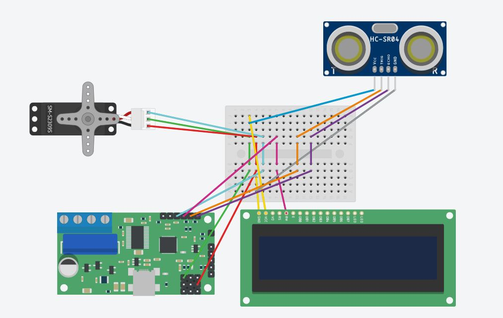

# Raspberry Pi README
## 개요
라즈베리파이 4B 보드를 이용해서 스마트키 임베디드 시스템을 만들었다. 

주요 기능으로는 서보 모터 제어를 해서 스마트키 잠금/헤제를 하고, 초음파 센서를 이용해서

사용자가 가까이 다가가면 LCD 화면이 켜지게 한다. LCD 화면에는 잠금/해제를 시행하면

open/close로 출력이 되고, 에러(서버 연결x)가 나오면 에러 메시지를 출력해준다.

## rpi_module.py 코드 설명
~~~python
import RPi.GPIO as GPIO  # 라즈베리파이 GPIO 관련 모듈
import time                     # time 제어를 위한 라이브러리
import json                     # 서버 통신을 위한 json 라이브러리
import requests                 # 서버 요청 라이브러리
import os
import drivers                  # lcd 조작을 위한 라이브러리
from time import sleep

servo_pin = 18                        # servo모터 18번 핀 사용
GPIO.setmode(GPIO.BCM)          # GPIO 핀들의 번호 지정 규칙
GPIO.setup(servo_pin, GPIO.OUT)       # 서보핀을 출력으로 지정
servo = GPIO.PWM(servo_pin, 50)       # 50 Hz
servo.start(0)                  # 서보모터 초기값 0
open_angle = 3.5                  # 열림
close_angle = 7                # 닫힘
state = ''
GPIO_TRIGGER = 24               # 초음파 거리 센서 트리거
GPIO_ECHO = 23                  # 초음파 거리 센서 에코
GPIO.setup(GPIO_TRIGGER, GPIO.OUT)  # 트리거는 초음파를 내보내므로 출력 모드
GPIO.setup(GPIO_ECHO, GPIO.IN)  # 에코는 초음파를 수신하므로 입력 모드
startTime = time.time()         # 초음파 센서의 시작시간과 도착시간 체크

def doAngle(angle):
    GPIO.setup(servo_pin, GPIO.OUT)   # 서보핀을 출력으로 설정
    servo.ChangeDutyCycle(angle)
    sleep(0.3)                        # 0.3 기다림
    GPIO.setup(servo_pin, GPIO.IN)    # 서보핀을 입력으로 설정 (더이상 움직이지 않음)

display = drivers.Lcd()         # Lcd
try:

    while True:
        msg = '{"serialNum": "0000001"}'        # json에 저장되어 있는 rpi 시리얼 넘버
        j = json.loads(msg)                     # msg를 불러옴
        r = requests.get('http://20.194.28.30:80/Smart-Key/rpi/remote/', json=j)    # 서버 주소
        res = r.json()
        res_code = res["code"]                  # 서버에서 보내는 errorcode
        res_message = res["message"]            # 서버에 기록되어 있는 상태값

        GPIO.output(GPIO_TRIGGER, False)        # 초음파 센서
        sleep(0.5)
        GPIO.output(GPIO_TRIGGER, True)
        sleep(0.00001)
        GPIO.output(GPIO_TRIGGER, False)

        while GPIO.input(GPIO_ECHO) == GPIO.LOW:    # 시작시간
            startTime = time.time()

        while GPIO.input(GPIO_ECHO) == GPIO.HIGH:   # 도착시간
            endTime = time.time()

        period = endTime - startTime
        distance = round(period * 17241, 2)         # 속도 = 거리/시간, 속도 = 340m/s, 거리 = distance, 시간 = period/2

        print(distance)
        display.lcd_backlight(0)
        if res_code == 200:
            print("정상적으로 연결되었습니다.")
            if res_message == state:            # 현재 키 상태 비교
                if distance <= 100:
                    display.lcd_backlight(1)
                else
                    display.lcd_backlight(0)
                continue                        # 동일하면 if문 탈출
            elif res_message == 'open':         # 현재 키 상태가 open 일때
                state = res_message
                if distance <= 100:
                    display.lcd_backlight(1)
                else
                    display.lcd_backlight(0)
                doAngle(open_angle)
                display.lcd_clear()
                display.lcd_display_string("Key_state: open", 1)
                sleep(1.5)
            elif res_message == 'close':        # 현재 키 상태가 close 일때
                state = res_message
                if distance <= 100:
                    display.lcd_backlight(1)
                else
                    display.lcd_backlight(0)
                doAngle(close_angle)
                display.lcd_clear()
                display.lcd_display_string("Key_state: close", 1)
                sleep(1.5)
        elif res_code == 400:                   # 존재하지 않는 키일 경우
            print("존재하지 않는 스마트키입니다.")
            if distance <= 100:
                display.lcd_backlight(1)
            else
                display.lcd_backlight(0)
            doAngle(close_angle)
            display.lcd_display_string("This is a non-", 1)
            display.lcd_display_string("existent key", 2)
            sleep(1.5)
        elif res_code == 500:                   # DB 오류가 발생하였을 경우
            print("DB 오류가 발생했습니다.")
            if distance <= 100:
                display.lcd_backlight(1)
            else
                display.lcd_backlight(0)
            doAngle(close_angle)
            display.lcd_display_string("DB error", 1)
            display.lcd_display_string("occurred", 2)
            sleep(1.5)
        else:                                   # 서버와 연결이 되지 않을 경우
            print("서버와 연결이 되지 않았습니다.")
            if distance <= 100:
                display.lcd_backlight(1)
            else
                display.lcd_backlight(0)
            doAngle(close_angle)
            display.lcd_display_string("No connection", 1)
            display.lcd_display_string("to server", 2)
            sleep(1.5)
except KeyboardInterrupt:
    servo.stop()
GPIO.cleanup()                                  # GPIO 핀 초기화
~~~
무한 루프(while)문을 이용해 스마트키를 제어한다. 스마트키(라즈베리파이)는 1.5초마다 서버에서

기록되어 있는 스마트키 상태를 GET해서 현재 상태와 비교한다. 같으면 반복을 하고,

앱에서 잠금/해제 요청이 오면 서버에 저장된 값이 바뀜으로 스마트키가 서버에 요청을 해서 값을 가지고 올때

상태 변화를 인지하고 해당 기능을 수행해준다. LCD는 초음파 센서를 이용해 거리값의 변화를 감지해서

가까워지면 LCD화면이 켜지고, 멀어지면 LCD화면이 꺼지는 방식으로 한다. 

## RPI Flowchart

## RPI Blueprint

